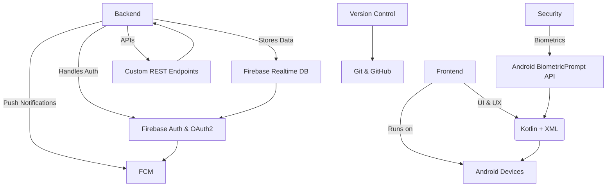

# 🚀 LetsLink

## Meet LetsLink: Your All-in-One Social Command Center

Tired of endless “what should we do?” group chats? *LetsLink* cuts through the noise — turning indecision into action while keeping everyone safe and connected.  

It’s the only app you need to *organize your crew, vote on events, and watch each other’s backs* ; all in one place.

*Plan smarter. Stay safer. Never miss a moment together.*

🎥 *App Overview Video:* [https://youtu.be/Mrn6nlbS0SI](https://youtu.be/Mrn6nlbS0SI)  
🔗 *API Overview Video:* [https://youtu.be/oXj7fFQ-EiA](https://youtu.be/oXj7fFQ-EiA)

---

## 🧩 Table of Contents
- [Features](#-features)
- [Custom Features (API Integrated)](#-custom-features-api-integrated)
- [Technology Stack](#-technology-stack)
- [Installation & Setup](#-installation--setup)
- [API Integration](#-api-integration)
- [Security Highlights](#-security-highlights)
- [Contributors](#-contributors)
- [License](#-license)

---

## ✨ Features

### 🔐 User Registration & Authentication
- Secure onboarding using *email and password* (min. 8 characters, at least one digit).  
- *Single Sign-On (SSO)* via *Google* and *Facebook* using *OAuth 2.0*.  
- *Biometric Authentication* (fingerprint and face unlock) using Android’s *BiometricPrompt API*.  
- Offers a smooth, secure login and registration process across all Android devices.

---

### 👥 Group Creation & Management
- Create and manage both *temporary groups* (for one-time events) and *permanent groups* (for ongoing circles).  
- Invite members via *email, username, or phone number*.  
- Each group includes:
  - Real-time group chat  
  - Event voting  
  - Collaborative to-do lists  
  - Safety and emergency alerts  

Groups act as a *central hub* for communication, coordination, and safety.

---

### 🗳 Event Voting with Swipe Interface
- Enjoy a *Tinder-style swipe UI* for easy, fun event voting.  
- Swipe *right* to vote Yes, *left* to vote No.  
- Event cards include:
  - Name  
  - Description  
  - Location  
  - Date and time  
  - Live vote count  
- Votes are tallied in *real-time*, ensuring transparency and democratic decision-making.

---

### 🎉 Custom Event Creation
- Create *personalized events* (e.g., picnics, braais, meetups).  
- Add *event name, **location, **date, **time, optional **description, and **event image*.  
- Custom events are visible to all group members for voting and coordination.  

---

### 💬 Real-Time Group Chat
- Real-time *messaging system* built into every group.  
- Supports *text messages* and *emojis* (attachments and media planned for future updates).  
- Push notifications via *Firebase Cloud Messaging (FCM)* ensure users never miss updates.  
- Chat history is stored and *synced across devices* using Firebase Realtime Database.

---

### 📝 Collaborative To-Do Lists
- Create and share *group-based task lists* for better event organization.  
- Tasks include:
  - Task name  
  - Optional due date/time  
  - Optional member assignment  
- Any member can *mark tasks complete/incomplete*, promoting shared responsibility.  

Perfect for reminders like “bring cash,” “buy snacks,” or “confirm transport.”

---

## 🔧 Custom Features (API Integrated)
LetsLink’s backend API powers several interactive features that make collaboration seamless:

1. *Group Creation & Management* – API endpoints handle user invitations, group type configuration, and group membership tracking.  
2. *Custom Event Creation* – Users can push new event data (name, location, description, image, date/time) to the database through API calls.  
3. *Collaborative To-Do Lists* – API endpoints manage creation, updates, and syncing of to-do list items across all members in real time.  

📺 *Watch the API video:* [https://youtu.be/oXj7fFQ-EiA](https://youtu.be/oXj7fFQ-EiA)

---


## ⚙ Technology Stack

| Component       | Technology                                    |
|-----------------|-----------------------------------------------|
| Frontend        | Kotlin + XML (Android Studio)                 |
| Backend         | Firebase Realtime Database                     |
| Authentication  | Firebase Auth, OAuth 2.0 (Google & Facebook) |
| Notifications   | Firebase Cloud Messaging (FCM)               |
| API Integration | Custom REST endpoints with Firebase           |
| Security        | Android BiometricPrompt API                   |
| Version Control | Git & GitHub                                  |

## 🌐 Tech Stack Diagram

---

## 🧠 API Integration

LetsLink’s core functionality is built around seamless API connectivity between the app and Firebase:

- *Realtime Syncing:* Firebase Realtime Database enables instant updates for chat, event votes, and to-do lists.  
- *Authentication:* Firebase Authentication and OAuth 2.0 provide secure login/registration pathways.  
- *Cloud Messaging:* FCM handles real-time notifications for chats, event updates, and safety alerts.  
- *Biometric Integration:* Android’s BiometricPrompt API offers native device-level authentication.  

---

## 🔒 Security Highlights

Security and privacy are central to LetsLink’s design:

- *Password Policy:* Minimum 8 characters with at least one numeric digit.  
- *OAuth 2.0 Compliance:* Safe and verified third-party login through Google and Facebook.  
- *Biometric Security:* Fingerprint and face unlock supported.  
- *Encrypted Communication:* All Firebase data is encrypted in transit and at rest.  
- *Authentication Tokens:* Managed securely through Firebase Auth to prevent unauthorized access.  

---

## 📲 Installation & Setup
### 1. Clone this repository:
0.
   ```bash
   git clone https://github.com/st10258321/LetsLink.git ```
  

### 2. Open the project in Android Studio

1.  Launch **Android Studio**.
    
2.  Click on **File > Open**.
    
3.  Navigate to the folder where you cloned the repository and select it.
    
4.  Wait for Android Studio to sync the project and download dependencies.
    

### 3. Configure your environment

-   Make sure you have the **latest Android SDK** installed.
    
-   Ensure your **Java JDK** version matches the project requirements.
    
-   Connect an Android device via USB or set up an **Android Emulator**.
    

### 4. Build the project

-   Click on **Build > Make Project** or press `Ctrl+F9` to build.
    
-   Resolve any missing dependencies if prompted.
    

### 5. Run the app

-   Select your device/emulator from the target dropdown.
    
-   Click **Run > Run 'app'** or press `Shift+F10`.
    
-   The app should launch on your selected device.
    


   


use this one instead the code runs better and the graph shows
